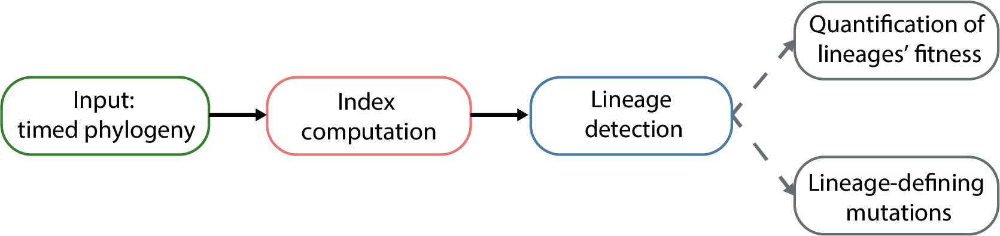

```{r setup, include=FALSE}
knitr::opts_chunk$set(echo = TRUE)
```

Last update: 10 September 2024

# Content of this repo

In this repo you will find:

1. In ```1_Data```, the data used in the paper.
2. In ```2_Functions```, the codes that are behind the analysis:
    * fitness index dynamics
    * lineages detection
    * lineage fitness estimation
    * lineage-defining mutations 
    
# Content of this README
 
1. [General guidance](#general-guidance) on how to use *phylowave* on your data 
2. [An example](#example-on-sars-cov-2) of lineage detection on a SARS-CoV-2 phylogeny

# General guidance

*phylowave* is an approach that summarises changes in population composition in phylogenetic trees of pathogens, allowing for the automatic detection of lineages based on shared fitness and evolutionary relationships. It is currently written in R, with the exception of the fitness model which is written in Stan. On principle, *phylowave* is applicable to any pathogen (*e.g.* from viruses and bacteria) provided a timed-phylogeny is available and the sampling is representative of the diversity.

Here we describe the general organisation of the pipeline, which is detailed in the following sections:

* [Input](#input)
* [Index computation](#index-computation)
* [Lineage detection](#lineage-detection)
* [Quantification of lineages' fitness](#quantification-of-lineages-fitness)
* [Lineage-defining mutations](#lineage-defining-mutations)

<!-- -->

## Input

The minimal inputs to use the pipeline are:

* a time-resolved phylogenetic tree, which must be *binary* and of class *phylo*
* the sampling times of all tips

## Index computation

To compute the index of all nodes, one needs:

* The genome length of the pathogen considered: *genome_length* (in bp).
* The mutation rate of the pathogen considered: *mutation_rate* (in bp/genome/year), an average is fine.
* The timescale: *timescale* (in years), this will be used to compute the bandwidth, see more details below.
* Window of time on which to search for samples in the population: *wind*, see more details below.

While *genome_length* and *mutation_rate* are pathogen-specific, the *timescale* and *wind* are both pathogen-specific and dataset-specific.

**timescale**: The timescale determines the kernel which enables to track lineage emergence dynamically, focusing on short distances between nodes (containing information about recent population dynamics) rather than long distances (containing information about past evolution). The timescale is tailored to the specific pathogen studied and its choice depends on the molecular signal, as well as the transmission rate. In the study, we used timescales ranging from months (typical of RNA viruses) to years (typical of bacteria). To determine a timescale suitable for your dataset, we recommend thinking about the generation time of the pathogen considered, its mutation rate, and the amount of diversity already accumulated. For example, at the time of the analysis, SARS-CoV-2 was a new pathogen, spreading quickly and accumulating diversity at a rate of ~2 mutations per month. Therefore, a small timescale of less than a year chosen (0.15 years). On the contrary, *Mycobacterium tuberculosis* is an older and relatively slowly spreading pathogen, which accumulates mutations at a rate of ~0.2 mutation per year. A much larger timescale was then chosen (30 years), to reflect this. Ultimately, the best timescale is one that maximises the visualisation of population dynamics. We recommend trying different values.

**wind**: The choice of *wind* will depend on the sampling intensity of the dataset. As a mean of example, for SARS-CoV-2, we set *wind* to 15 days, as the dataset was intensely sampled. But for *Bordetella pertussis*, which is more sparsely sampled, we chose a *wind* of 1 year. If *wind* is too large, then all the nodes are considered to be part of the same time window. If *wind* is too small, then only the nodes in direct proximity of the node of interest will be considered in the time window, which can result in noisy index dynamics.

The function *compute.index* will take those parameters in input, as well as the tree, the distance matrice and the metadata dataframe. The function will compute the index of all nodes (internal and terminal). See [the example](#example-on-sars-cov-2) for more details.

To store the data throughout the analysis, we use a main dataset called *dataset_with_nodes* which looks like this: 

| ID        | name_seq   | time      | is.node  | Known clade classification | Index |
| --------- |:----------:| ---------:| --------:| --------------------------:|------:|
| $1$       | $name\_1$  | $t_1$     | 'no'     |                            |       |
| $2$       | $name\_2$  | $t_2$     | 'no'     |                            |       |
| $3$       | $name\_3$  | $t_3$     | 'no'     |                            |       |
| ...       | ...        | ...       | ...      |                            |       |
| $n$       | $name\_n$  | $t_n$     | 'no'     |                            |       |
| $n +1$    | $n + 1$    | $t_{n+1}$ | 'yes'    |                            |       |
| ...       | ...        | ...       | ...      |                            |       |
| $2n-1$    | $2n-1$     | $t_{2n-1}$| 'yes'    |                            |       |  
       
Where $n$ is the number of tips (terminal nodes) in the tree. The column 'Known clade classification' is optional, but is useful to compare the results to existing sequence classifications. The index of each node (internal and terrminal) is stored in the column 'Index'. See code in [the example](#example-on-sars-cov-2).

## Lineage detection

To run the lineage detection algorithm, use the function *find.groups.by.index.dynamics*, you will need different inputs: 

1. Data: *timed_tree* and *metadata* (*dataset_with_nodes*)
2. Lineage detection parameters:
    * *min_descendants_per_tested_node*: to start the analysis, start from nodes that have this minimum number of sequences
    * *min_group_size*: minimum group size, when creating a new potential split
    * *node_support*: numeric value of support of each node (e.g. mutations on the branch leading to the node, or bootstrap support)
    * *threshold_node_support*: threshold on the node support for the nodes to be considered in the detection algorithm
    * *weight_by_time*: size of the window of time on which to compute the weights (NULL or numeric, in years)
    * *weighting_transformation*: type of weighting to use (NULL, inv_freq, inv_sqrt, or inv_log)
    * *max_groups_found*: maximum number of groups to find (Integer) 
3. Technical parameters: they do not necessarily need to be updated (see the function documentation for details): *p_value_smooth*, *stepwise_deviance_explained_threshold*, *stepwise_AIC_threshold*, *k_smooth*, *parallelize_code*, *number_cores*, *plot_screening* and *keep_track*.

The function outputs multiple elements in a list:

* potential_splits: vector of the nodes included in most complex model tested
* best_dev_explained: vector of the deviance explained by the best models for each number of groups
* first_dev: the null deviance of the initial model (when no lineage is present)
* best_AIC : vector of the AIC of the best models for each number of groups
* best_BIC: vector of the BIC of the best models for each number of groups
* best_summary: list of the summaries of the best models for each number of groups
* best_mod: list of the best models for each number of groups
* best_groups: list of the groups used in the best models for each number of groups
* best_nodes_names: list of the nodes included in the best models for each number of groups

Typically, one chooses a value of *max_groups_found* greater than the expected number of lineages. The algorithm then runs until it finds all those groups, or until it cannot find any significant split anymore. The user can then check the deviance explained by all the models with increasing complexity and choose an adequate number of groups. 

Once the split nodes have been defined, the user can then extract the group ID for each node using the function *merge.groups*. One can choose to refine these groups if needed, by setting a minimum number of nodes per group (*group_count_threshold*) or a minimum frequency of each group (*group_freq_threshold*). 

For an example, see the [SARS-CoV-2 code](#example-on-sars-cov-2) below.

## Post-hoc analyses

Two main post-hoc analyse can be done and are briefly described below.

### Quantification of lineages' fitness

To quantify the fitness of each lineage, we developed a multinomial logistic model to fit the proportion of tips and nodes that belong to each lineage through time. This is done by using the function *estimate_rel_fitness_groups_with_branches*, which takes in entry: 

* the *dataset_with_nodes* dataframe, with a column 'groups' which gives the group ID of each node in the dataset
* the timed tree
* *min_year*, the starting year at which to start fitting the model
* the window size (*window*), or number of windows (*N*), to divide the time series (from *min_year* to the last time point), compute proportions and fit the model.

For an example, see the [SARS-CoV-2 code](#example-on-sars-cov-2) below.

### Lineage-defining mutations

Use the function *association_scores_per_group* to compute the association score of each mutation to each group. The function takes in entry:

* *dataset_with_nodes*
* *dataset_with_inferred_reconstruction*: a dataframe with the same first columns as *dataset_with_nodes* and then one column per snp its ancestral reconstruction along all nodes
* *tree*: timed tree
* *possible_snps*: the list of mutations that need to be considered
* *upstream_window*: for each group, how far upstream to consider mutations
* *downstream_window*: for each group, consider nodes from the MRCA up to this time

The codes to perform this analysis on the SARS-CoV-2 data is available in the file *2_4_Lineage_Defining_mutations.R*, in the folder ```2_Functions```. As the SARS-CoV-2 genetic data is restricted, we cannot provide the raw data, but it is downloadable on GISAID.

# Example on SARS-CoV-2

We provide here a working example on the SARS-CoV-2 timed phylogeny. 
You can go to specific sections of interest, however we recommend reading through all of this example.

Sections of this example:

* [Load codes and SARS-CoV-2 data](#load-codes-and-sars-cov-2-data)
* [Compute the SARS-CoV-2 index dynamics](#compute-the-sars-cov-2-index-dynamics)
* [Find SARS-CoV-2 clades based on index dynamics](#find-sars-cov-2-clades-based-on-index-dynamics-)
* [Quantify the fitness of detected SARS-CoV-2 lineage](#quantify-the-fitness-of-detected-sars-cov-2-lineage)

## Load codes and SARS-CoV-2 data

#### Load index functions

```{r, echo = F, eval=T}
## Not printed, set directory
setwd('~/Documents/THD/Index_paper_methods_Sc2_H3N2_BP_TB/paper-index-fitness-dynamics-trees/')
```

First, source all the necessary functions:
```{r, eval=T}
source(file = '2_Functions/2_1_Index_computation_20240909.R')
source(file = '2_Functions/2_2_Lineage_detection_20240909.R')
source(file = '2_Functions/2_3_Lineage_fitness_20240909.R')
```

Load necessary packages
```{r, echo = T, eval=T, , results = 'hide', warning=FALSE, message=FALSE}
library(ape, quiet = T); library(phytools, quiet = T); library(stringr, quiet = T)
library(MetBrewer, quiet = T); library(parallel, quiet = T); library(mgcv, quiet = T)
library(cowplot, quiet = T); library(ggplot2, quiet = T); library(ggtree, quiet = T);
library(cmdstanr, quiet = T); library(binom, quiet = T)
```

Versions:

Packages:
ape v5.7-1, phytools v1.9-16, stringr v1.5.0, MetBrewer v0.2.0, parallel v4.1.2, mgcv v1.8-42, cowplot v1.1.1, ggplot2 v3.4.3, ggtree v3.2.1, cmdstanr v0.5.2, binom v1.1

R: 4.1.2
 
#### Load data

Load the NexStrain SARS-CoV-2 tree, in which all the tip name include: collection time, location and Pango lineage 
```{r, eval=T}
tree_sars_cov2 = read.nexus('1_Data/1_1_SARS_CoV_2/Tree_SARSCoV2_global_alltime_nextstrain_20230414.nexus')
## Make sure the tree is binary, and ladderized
tree_sars_cov2 = collapse.singles(ladderize(multi2di(tree_sars_cov2, random = F), right = F))
## Names all sequences
names_seqs = tree_sars_cov2$tip.label
n_seq = length(names_seqs)
## Collection times of all sequences
times_seqs = as.numeric(sapply(names_seqs, function(x)tail(str_split(x, pattern = '/')[[1]],2)[1]))
## Nextstrain clades of all sequences
clades_seqs = sapply(names_seqs, function(x)tail(str_split(x, pattern = '/')[[1]],1))
```


## Compute the SARS-CoV-2 index dynamics

#### Index parameters 

Set the index parameters.
```{r, eval=T}
## Length genome 
genome_length = 29903 # reference nextstrain https://www.ncbi.nlm.nih.gov/nuccore/MN908947
## Mutation rate 
mutation_rate = 8.1e-4 # mutation rate used by nextstrain https://github.com/nextstrain/ncov
## Parameters for the index
timescale = 0.15 ## Timescale
## Window of time on which to search for samples in the population
wind = 15 #days
wind = wind/365
```


#### Compute pairwise distance matrix
Compute distance between each pair of sequences and internal nodes in the tree
```{r, eval=T}
genetic_distance_mat = dist.nodes.with.names(tree_sars_cov2)
```

Get the time of each internal node
```{r, eval=T}
nroot = length(tree_sars_cov2$tip.label) + 1 ## Root number
distance_to_root = genetic_distance_mat[nroot,]
root_height = times_seqs[which(names_seqs == names(distance_to_root[1]))] - distance_to_root[1]
nodes_height = root_height + distance_to_root[n_seq+(1:(n_seq-1))]
```

#### Preparation data tips and nodes

Prepare the main dataframe, where the index and lineages of all nodes (internal and terminal) are going to be stored.
```{r, eval=T}
# Meta-data with all nodes 
dataset_with_nodes = data.frame('ID' = c(1:n_seq, n_seq+(1:(n_seq-1))),
                                'name_seq' = c(names_seqs, n_seq+(1:(n_seq-1))),
                                'time' = c(times_seqs, nodes_height),
                                'is.node' = c(rep('no', n_seq), rep('yes', (n_seq-1))),
                                'Nextstrain_clade' = c(clades_seqs, rep(NA, n_seq-1)))
```


#### Compute index of every tip and node
```{r, eval=T}
dataset_with_nodes$index = compute.index(time_distance_mat = genetic_distance_mat, 
                                         timed_tree = tree_sars_cov2, 
                                         time_window = wind,
                                         metadata = dataset_with_nodes, 
                                         mutation_rate = mutation_rate,
                                         timescale = timescale,
                                         genome_length = genome_length)
```

#### Plot tree & index below, with colors from NextStrain clades

First, generate the color key, based on the Nextstrain clade of each sequence.
```{r, eval=T}
## Color key for Nextstrain clades
colors_clade = met.brewer(name="Cross", n=length(levels(as.factor(dataset_with_nodes$Nextstrain_clade))), type="continuous")

## Color of each node, based on the key
dataset_with_nodes$Nextstrain_clade_color = as.factor(dataset_with_nodes$Nextstrain_clade)
clade_labels = levels(dataset_with_nodes$Nextstrain_clade_color)
levels(dataset_with_nodes$Nextstrain_clade_color) = colors_clade
dataset_with_nodes$Nextstrain_clade_color = as.character(dataset_with_nodes$Nextstrain_clade_color)
```

Then plot the tree and index:
```{r, eval=T}
par(mfrow = c(2,1), oma = c(0,0,0,0), mar = c(4,4,0,0))

min_year = 2020
max_year = 2023.5

## Tree
plot(tree_sars_cov2, show.tip.label = FALSE, 
     edge.color = 'grey', edge.width = 0.25,
     x.lim = c(min_year, max_year)-root_height)
tiplabels(pch = 16, col = dataset_with_nodes$Nextstrain_clade_color, cex = 0.3)
axisPhylo_NL(side = 1, root.time = root_height, backward = F,
             at_axis = seq(min_year, max_year, 0.5)-root_height,
             lab_axis = seq(min_year, max_year, 0.5), lwd = 0.5)
## Index
plot(dataset_with_nodes$time, 
     dataset_with_nodes$index, 
     col = adjustcolor(dataset_with_nodes$Nextstrain_clade_color, alpha.f = 1),
     bty = 'n', xlim = c(min_year, max_year), cex = 0.4,
     pch = 16, bty = 'n', ylim = c(0, 1), 
     main = paste0(''), 
     ylab = 'Index', xlab = 'Time (years)', xaxt = 'n', yaxt = 'n')
axis(2, las = 2, lwd = 0.5)
axis(1, lwd = 0.5)

# Color key
legend('topright', 
       legend = clade_labels,
       fill = colors_clade, border = colors_clade,
       cex = 0.5, bty = 'n', ncol = 5)
```


## Find SARS-CoV-2 clades based on index dynamics 

#### Run the lineage detection algorithm on SARS-CoV-2 data

Parameters fro the detection: 
```{r, eval = T, eval=FALSE}
time_window_initial = 2030;
time_window_increment = 100;
p_value_smooth = 0.05
weight_by_time = 0.1
k_smooth = -1
plot_screening = F
min_descendants_per_tested_node = 30
min_group_size = 30
weighting_transformation = c('inv_sqrt')

parallelize_code = T
number_cores = 2

max_stepwise_deviance_explained_threshold = 0
max_groups_found = 13
stepwise_AIC_threshold = 0

keep_track = T
```


Run the detection function (this steps takes approximately <10 min on 2 cores):
```{r, eval=FALSE, results = 'hide', warning=FALSE, message=FALSE}
start_time = Sys.time()
potential_splits = find.groups.by.index.dynamics(timed_tree = tree_sars_cov2,
                                                 metadata = dataset_with_nodes,
                                                 node_support = tree_sars_cov2$edge.length[match((n_seq+1):(2*n_seq-1), tree_sars_cov2$edge[,2])],
                                                 threshold_node_support = 1/(29903*0.00081),
                                                 time_window_initial = time_window_initial,
                                                 time_window_increment = time_window_increment,
                                                 min_descendants_per_tested_node = min_descendants_per_tested_node,
                                                 min_group_size = min_group_size,
                                                 p_value_smooth = p_value_smooth,
                                                 stepwise_deviance_explained_threshold = max_stepwise_deviance_explained_threshold,
                                                 stepwise_AIC_threshold = stepwise_AIC_threshold,
                                                 weight_by_time = weight_by_time,
                                                 weighting_transformation = weighting_transformation,
                                                 k_smooth = k_smooth,
                                                 parallelize_code = parallelize_code,
                                                 number_cores = number_cores, 
                                                 plot_screening = plot_screening,
                                                 max_groups_found = max_groups_found, 
                                                 keep_track = keep_track)
end_time = Sys.time()
print(end_time - start_time)
```

Instead, you may wish to load the results:
```{r, eval = T}
potential_splits = readRDS('README_files/potential_splits.rds')
```

Look at the deviance explained by the models with different number of groups. Here for simplicity we directly chose max_groups_found = 13, which is the number of groups used in the original analysis. To decide on 13 groups, we initially ran the algorithm up to 30 groups.
```{r, eval = T}
df_explained_dev = data.frame('N_groups' = 0:length(potential_splits$best_dev_explained),
                              'Non_explained_deviance' = (1-c(potential_splits$first_dev, potential_splits$best_dev_explained)),
                              'Non_explained_deviance_log' = log(1-c(potential_splits$first_dev, potential_splits$best_dev_explained)))
df_explained_dev$Non_explained_deviance_log = df_explained_dev$Non_explained_deviance_log-min(df_explained_dev$Non_explained_deviance_log)

par(mfrow = c(1,2), oma = c(2,2,1,1), mar = c(2,2,2,0.5), mgp = c(0.75,0.25,0), cex.axis=0.5, cex.lab=0.5, cex.main=0.7, cex.sub=0.5)
plot(df_explained_dev$N_groups,
     df_explained_dev$Non_explained_deviance,
     bty = 'n', ylim = c(0, ceiling(10*max(df_explained_dev$Non_explained_deviance))/10),
     xaxt = 'n', yaxt = 'n', pch = 16, main = 'linear scale', cex = 0.5, 
     ylab = 'Non-explained deviance (%)', xlab = 'Number of groups')
axis(1, lwd = 0.5, tck=-0.02)
axis(2, las = 2, at = seq(0,ceiling(10*max(df_explained_dev$Non_explained_deviance))/10,0.1),
     labels = seq(0, ceiling(10*max(df_explained_dev$Non_explained_deviance))/10,0.1)*100, lwd = 0.5, tck=-0.02)

plot(df_explained_dev$N_groups,
     (df_explained_dev$Non_explained_deviance),
     log = 'y',
     ylim = c(0.01, 1),
     bty = 'n',
     xaxt = 'n', yaxt = 'n', pch = 16, main = 'log scale', cex = 0.5, 
     ylab = 'Non-explained deviance (%) - log scale', xlab = 'Number of groups')
axis(1, lwd = 0.5, tck=-0.02)
axis(2, las = 2, at = c(0.01, 0.1, 0.25, 0.5, 1),
     labels = c(0.01, 0.1, 0.25, 0.5, 1)*100, lwd = 0.5, tck=-0.02)
```


Optimize the number of groups: set the minimum number of sequences per group to 30, with a minimum frequency of 1%.
```{r, eval = T}
split = merge.groups(timed_tree = tree_sars_cov2, metadata = dataset_with_nodes, 
                     initial_splits = potential_splits$potential_splits, 
                     group_count_threshold = 30, group_freq_threshold = 0.01)
```

Label sequences with these new groups, and assign a color to each of them.
```{r, eval = T}
## Label sequences with new groups
dataset_with_nodes$groups = as.factor(split$groups)
## Reorder labels by time of emergence
name_groups = levels(dataset_with_nodes$groups)
time_groups_world = NULL
for(i in 1:length(name_groups)){
  time_groups_world = c(time_groups_world, min(dataset_with_nodes$time[which(dataset_with_nodes$groups == name_groups[i] &
                                                                                   dataset_with_nodes$is.node == 'no')]))
}
levels(dataset_with_nodes$groups) = match(name_groups, order(time_groups_world, decreasing = T))
dataset_with_nodes$groups = as.numeric(as.character(dataset_with_nodes$groups))
dataset_with_nodes$groups = as.factor(dataset_with_nodes$groups)
## Update names in split list
split$tip_and_nodes_groups = match(split$tip_and_nodes_groups, order(time_groups_world, decreasing = T))
names(split$tip_and_nodes_groups) = 1:length(split$tip_and_nodes_groups)
split$groups = as.factor(split$groups)
levels(split$groups) = match(name_groups, order(time_groups_world, decreasing = T))
split$groups = as.numeric(as.character(split$groups))
## Choose color palette
n_groups <- length(name_groups)
colors_groups = (met.brewer(name="Cross", n=n_groups, type="continuous"))
## Color each group
dataset_with_nodes$group_color = dataset_with_nodes$groups
levels(dataset_with_nodes$group_color) = colors_groups
dataset_with_nodes$group_color = as.character(dataset_with_nodes$group_color)
```


#### Plot tree & index below, with colors from index-defined groups

Plot the tree and index colored with the new groups:
```{r, eval = T}
par(mfrow = c(2,1), oma = c(0,0,0,0), mar = c(4,4,0,0))

## Tree
plot(tree_sars_cov2, show.tip.label = FALSE, 
     edge.color = 'grey', edge.width = 0.25,
     x.lim = c(min_year, max_year)-root_height)
tiplabels(pch = 16, col = dataset_with_nodes$group_color, cex = 0.3)
axisPhylo_NL(side = 1, root.time = root_height, backward = F,
             at_axis = seq(min_year, max_year, 0.5)-root_height,
             lab_axis = seq(min_year, max_year, 0.5), lwd = 0.5)

## Index colored by group
plot(dataset_with_nodes$time, 
     dataset_with_nodes$index, 
     col = adjustcolor(dataset_with_nodes$group_color, alpha.f = 1),
     bty = 'n', xlim = c(min_year, max_year), cex = 0.5,
     pch = 16, bty = 'n', #ylim = c(0, 1), 
     main = paste0(''), #log = 'y',
     ylab = 'Index', xlab = 'Time (years)', yaxt = 'n')
axis(2, las = 2)
# Color key
legend('topright', 
       legend = name_groups,
       fill = colors_groups, border = colors_groups,
       cex = 0.5, bty = 'n', ncol = 5)
```

#### Compare NextStrain groups and groups called with the index

Generate SARS-CoV-2 trees colored with each set of groups next to each other:
```{r, eval = T, results = 'hide', warning=FALSE, message=FALSE}
## Tree with index-defined groups
groups = matrix(dataset_with_nodes$groups[which(dataset_with_nodes$is.node == 'no')], ncol = 1)
colnames(groups) = 'groups'
rownames(groups) = dataset_with_nodes$name_seq[which(dataset_with_nodes$is.node == 'no')]
cols = as.character(colors_groups)
names(cols) = as.character(1:max(as.numeric(name_groups)))
plot_tree_sars_world_groups <- ggtree(tree_sars_cov2, mrsd=lubridate::date_decimal(max(times_seqs)), size = 0.10,
                   aes(color = as.character(dataset_with_nodes$groups))) + 
  scale_color_manual(values = cols)+theme_tree2()
plot_tree_sars_world_groups = gheatmap(plot_tree_sars_world_groups, groups, offset=0.1, width=0.10, 
                    colnames=FALSE, legend_title="Group", color=NA) +
  scale_fill_manual(values = (cols))+scale_y_continuous(expand=c(0, 0.3))+theme(legend.position = 'none')

## Tree with NextStrain clades
Nextstrain = matrix(dataset_with_nodes$Nextstrain_clade[which(dataset_with_nodes$is.node == 'no')], ncol = 1)
colnames(Nextstrain) = 'groups'
rownames(Nextstrain) = dataset_with_nodes$name_seq[which(dataset_with_nodes$is.node == 'no')]
cols_NextStrain = as.character(colors_clade)
names(cols_NextStrain) = clade_labels
plot_tree_sars_world_Nextstrain <- ggtree(tree_sars_cov2, mrsd=lubridate::date_decimal(max(times_seqs)), size = 0.10,
                                          aes(color = as.character(dataset_with_nodes$Nextstrain_clade))) + 
  scale_color_manual(values = cols_NextStrain)+
  theme_tree2(legend = 'none')
plot_tree_sars_world_Nextstrain = gheatmap(plot_tree_sars_world_Nextstrain, Nextstrain, offset=0.1, width=0.10, 
                     colnames=FALSE, legend_title="Group", color=NA) +
  scale_fill_manual(values = cols_NextStrain, na.value = 'white')+
  scale_x_reverse() + 
  scale_y_continuous(expand=c(0, 0.3))+
  theme(legend.position = 'none')
```

Plot the generated SARS-CoV-2 trees:
```{r, eval = T}
plot_grid(plot_tree_sars_world_groups, plot_tree_sars_world_Nextstrain,
          rel_widths = c(1, 1), labels = c('Automatic clades', 'NextStrain clades'), label_size = 10, label_x = c(0.1, 0.25), ncol = 2)
```


## Quantify the fitness of detected SARS-CoV-2 lineage

#### Run the fitness model
Quantify the fitness of each group you can run the code (this steps takes approximately <5 min on 3 cores):
```{r, eval = F, results = 'hide', warning=FALSE, message=FALSE}
start_time = Sys.time()
## Load and compile stan code (this can take a few minutes)
model_compiled <- cmdstan_model(stan_file = '2_Functions/Model_multinomial_logistic_birthdeath_lineage_fitness_20231220.stan')
## Run model on SARS-CoV-2 groups
res_fitness = estimate_rel_fitness_groups_with_branches(dataset_with_nodes = dataset_with_nodes,
                                                        tree = tree_sars_cov2,
                                                        min_year = 2020, 
                                                        window = 30/365,
                                                        model_compiled = model_compiled,
                                                        iter_warmup = 250, iter_sampling = 500, refresh = 50, seed = 1)
end_time = Sys.time()
print(end_time - start_time)
```
You might encounter a warning saying that '*alpha_true_GA*' has a missing init value - this is normal as those groups (ancestral groups that are not present at the start of the time series) do not always exist and therefore there is no default initial value. This is does not impact the model run. The seed has been set to 1 so allow for reproducible results.

To save some time, you may wish to load the results:
```{r, eval = T}
res_fitness = readRDS('README_files/res_fitness.rds')
```

#### Plot the fits and estimated parameters
Plot the fits:
```{r}
order_colors = order(as.numeric(split$tip_and_nodes_groups))
colour_lineage = colors_groups[match(split$tip_and_nodes_groups[order_colors], name_groups)]

plot_fit_data_new(data = res_fitness$data,
                  Chains = res_fitness$chains,
                  colour_lineage = colour_lineage,
                  xmin = 2020, xmax = 2023.5)
```

Plot the predicted vs observed proportions:
```{r}
plot_observed_vs_predicted(data = res_fitness$data,
                           Chains = res_fitness$chains,
                           colour_lineage = colour_lineage)
```

Plot raw fitness estimates:
```{r}
plot_estimated_fitness_ref_ancestral(data = res_fitness$data,
                                     Chains = res_fitness$chains,
                                     colour_lineage = colour_lineage, 
                                     gentime = 1)
```


