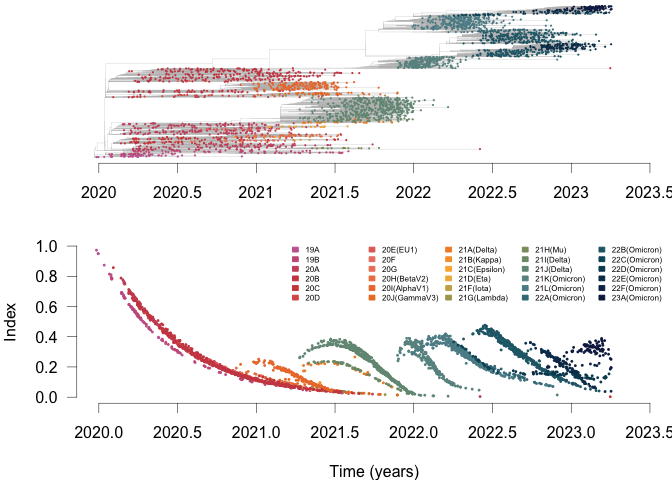
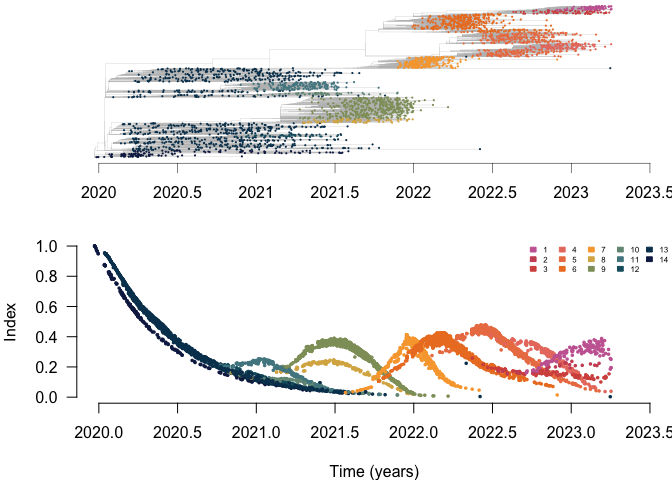
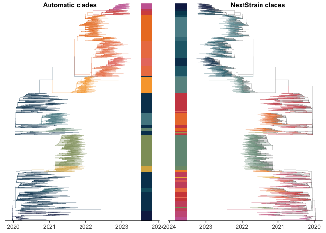

Code for the paper ‘Learning the fitness dynamics of pathogens from
phylogenies’
================

Last update: 3 January 2024

# Content of this repo

In this repo you will find:

1.  In `1_Data`, the data used in the paper.
2.  In `2_Functions`, the codes that are behind the analysis:
    - fitness index dynamics
    - lineages detection
    - lineage fitness estimation (will be updated soon)
    - lineage-defining mutations (will be updated soon)
3.  In `3_Analysis_per_pathogen`, the analysis for each pathogen (will
    be updated soon)

*Below is a brief example of what can be archived on SARS-CoV-2, using
the codes in the folder `2_Codes`.*

# Example on SARS-CoV-2

## Load codes and data

#### Load index functions

First, source all the functions of this repo.

``` r
source(file = '2_Functions/2_1_Index_computation_20231220.R')
source(file = '2_Functions/2_2_Lineage_detection_20231220.R')
source(file = '2_Functions/2_3_Lineage_fitness_estimation.R')
source(file = '2_Functions/2_4_Lineage_defining_mutations.R')
```

Load necessary packages

``` r
library(ape, quiet = T); library(phytools, quiet = T); library(stringr, quiet = T)
library(MetBrewer, quiet = T); library(parallel, quiet = T); library(mgcv, quiet = T)
library(cowplot, quiet = T); library(ggplot2, quiet = T); library(ggtree, quiet = T)
```

#### Load data

Load the NexStrain SARS-CoV-2 tree, in which all the tip name include:
collection time, location and Pango lineage

``` r
tree_sars_cov2 = read.nexus('1_Data/1_1_SARS_CoV_2/Tree_SARSCoV2_global_alltime_nextstrain_20230414.nexus')
## Make sure the tree is binary, and ladderized
tree_sars_cov2 = collapse.singles(ladderize(multi2di(tree_sars_cov2, random = F), right = F))
## Names all sequences
names_seqs = tree_sars_cov2$tip.label
n_seq = length(names_seqs)
## Collection times of all sequences
times_seqs = as.numeric(sapply(names_seqs, function(x)tail(str_split(x, pattern = '/')[[1]],2)[1]))
## Nextstrain clades of all sequences
clades_seqs = sapply(names_seqs, function(x)tail(str_split(x, pattern = '/')[[1]],1))
```

#### Index parameters

Set the index parameters.

``` r
## Length genome 
genome_length = 29903 # reference nextstrain https://www.ncbi.nlm.nih.gov/nuccore/MN908947
## Mutation rate 
mutation_rate = 8.1e-4 # mutation rate used by nextstrain https://github.com/nextstrain/ncov
## Parameters for the index
timescale = 0.15 ## Timescale
## Window of time on which to search for samples in the population
wind = 15 #days
wind = wind/365
```

## Compute the index dynamics

#### Compute pairwise distance matrix

Compute distance between each pair of sequences and internal nodes in
the tree

``` r
genetic_distance_mat = dist.nodes.with.names(tree_sars_cov2)
```

Get the time of each internal node

``` r
nroot = length(tree_sars_cov2$tip.label) + 1 ## Root number
distance_to_root = genetic_distance_mat[nroot,]
root_height = times_seqs[which(names_seqs == names(distance_to_root[1]))] - distance_to_root[1]
nodes_height = root_height + distance_to_root[n_seq+(1:(n_seq-1))]
```

#### Preparation data tips and nodes

Prepare the main dataframe, where the index and lineages of all nodes
(internal and terminal) are going to be stored.

``` r
# Meta-data with all nodes 
dataset_with_nodes = data.frame('ID' = c(1:n_seq, n_seq+(1:(n_seq-1))),
                                'name_seq' = c(names_seqs, n_seq+(1:(n_seq-1))),
                                'time' = c(times_seqs, nodes_height),
                                'is.node' = c(rep('no', n_seq), rep('yes', (n_seq-1))),
                                'Nextstrain_clade' = c(clades_seqs, rep(NA, n_seq-1)))
```

#### Compute index of every tip and node

``` r
dataset_with_nodes$index = Index::compute.index(time_distance_mat = genetic_distance_mat, 
                                                timed_tree = tree_sars_cov2, 
                                                time_window = wind,
                                                metadata = dataset_with_nodes, 
                                                mutation_rate = mutation_rate,
                                                timescale = timescale,
                                                genome_length = genome_length)
```

## Plot tree & index below, with colors from NextStrain clades

First, generate the color key, based on the Nextstrain clade of each
sequence.

``` r
## Color key fro Nextstrain clades
colors_clade = met.brewer(name="Cross", n=length(levels(as.factor(dataset_with_nodes$Nextstrain_clade))), type="continuous")

## Color of each node, based on the key
dataset_with_nodes$Nextstrain_clade_color = as.factor(dataset_with_nodes$Nextstrain_clade)
clade_labels = levels(dataset_with_nodes$Nextstrain_clade_color)
levels(dataset_with_nodes$Nextstrain_clade_color) = colors_clade
dataset_with_nodes$Nextstrain_clade_color = as.character(dataset_with_nodes$Nextstrain_clade_color)
```

Then plot the tree and index:

``` r
par(mfrow = c(2,1), oma = c(0,0,0,0), mar = c(4,4,0,0))

min_year = 2020
max_year = 2023.5

## Tree
plot(tree_sars_cov2, show.tip.label = FALSE, 
     edge.color = 'grey', edge.width = 0.25,
     x.lim = c(min_year, max_year)-root_height)
tiplabels(pch = 16, col = dataset_with_nodes$Nextstrain_clade_color, cex = 0.3)
axisPhylo_NL(side = 1, root.time = root_height, backward = F,
             at_axis = seq(min_year, max_year, 0.5)-root_height,
             lab_axis = seq(min_year, max_year, 0.5), lwd = 0.5)
## Index
plot(dataset_with_nodes$time, 
     dataset_with_nodes$index, 
     col = adjustcolor(dataset_with_nodes$Nextstrain_clade_color, alpha.f = 1),
     bty = 'n', xlim = c(min_year, max_year), cex = 0.4,
     pch = 16, bty = 'n', ylim = c(0, 1), 
     main = paste0(''), 
     ylab = 'Index', xlab = 'Time (years)', xaxt = 'n', yaxt = 'n')
axis(2, las = 2, lwd = 0.5)
axis(1, lwd = 0.5)

# Color key
legend('topright', 
       legend = clade_labels,
       fill = colors_clade, border = colors_clade,
       cex = 0.5, bty = 'n', ncol = 5)
```

<!-- -->

## Find clades based on index dynamics

#### Run the lineage detection algorithm

Parameters fro the detection:

``` r
time_window_initial = 2030;
time_window_increment = 100;
p_value_smooth = 0.05
weight_by_time = 0.1
k_smooth = -1
plot_screening = F
min_descendants_per_tested_node = 30
min_group_size = 30
weighting_transformation = c('inv_sqrt')

parallelize_code = T
number_cores = 2

max_stepwise_deviance_explained_threshold = 0
max_groups_found = 13
stepwise_AIC_threshold = 0

keep_track = T
```

Run the detection function (this steps takes approximately \<10 min on 2
cores):

``` r
start_time = Sys.time()
potential_splits = find.groups.by.index.dynamics(timed_tree = tree_sars_cov2,
                                                 metadata = dataset_with_nodes,
                                                 node_support = tree_sars_cov2$edge.length[match((n_seq+1):(2*n_seq-1), tree_sars_cov2$edge[,2])],
                                                 threshold_node_support = 1/(29903*0.00081),
                                                 time_window_initial = time_window_initial,
                                                 time_window_increment = time_window_increment,
                                                 min_descendants_per_tested_node = min_descendants_per_tested_node,
                                                 min_group_size = min_group_size,
                                                 p_value_smooth = p_value_smooth,
                                                 stepwise_deviance_explained_threshold = max_stepwise_deviance_explained_threshold,
                                                 stepwise_AIC_threshold = stepwise_AIC_threshold,
                                                 weight_by_time = weight_by_time,
                                                 weighting_transformation = weighting_transformation,
                                                 k_smooth = k_smooth,
                                                 parallelize_code = parallelize_code,
                                                 number_cores = number_cores, 
                                                 plot_screening = plot_screening,
                                                 max_groups_found = max_groups_found, 
                                                 keep_track = keep_track)
end_time = Sys.time()
print(end_time - start_time)
```

Instead, you may wish to load the results:

``` r
potential_splits = readRDS('README_files/potential_splits.rds')
```

Optimize the number of groups: set the minimum number of sequences per
group to 30, with a minimum frequency of 1%.

``` r
split = merge.groups(timed_tree = tree_sars_cov2, metadata = dataset_with_nodes, 
                     initial_splits = potential_splits$potential_splits, 
                     group_count_threshold = 30, group_freq_threshold = 0.01)
```

Label sequences with these new groups, and assign a color to each of
them.

``` r
## Label sequences with new groups
dataset_with_nodes$groups = as.factor(split$groups)
## Reorder labels by time of emergence
name_groups = levels(dataset_with_nodes$groups)
time_groups_world = NULL
for(i in 1:length(name_groups)){
  time_groups_world = c(time_groups_world, min(dataset_with_nodes$time[which(dataset_with_nodes$groups == name_groups[i] &
                                                                                   dataset_with_nodes$is.node == 'no')]))
}
levels(dataset_with_nodes$groups) = match(name_groups, order(time_groups_world, decreasing = T))
dataset_with_nodes$groups = as.numeric(as.character(dataset_with_nodes$groups))
dataset_with_nodes$groups = as.factor(dataset_with_nodes$groups)
## Update names in split list
split$tip_and_nodes_groups = match(split$tip_and_nodes_groups, order(time_groups_world, decreasing = T))
names(split$tip_and_nodes_groups) = 1:length(split$tip_and_nodes_groups)
split$groups = as.factor(split$groups)
levels(split$groups) = match(name_groups, order(time_groups_world, decreasing = T))
split$groups = as.numeric(as.character(split$groups))
## Choose color palette
n_groups <- length(name_groups)
colors_groups = (met.brewer(name="Cross", n=n_groups, type="continuous"))
## Color each group
dataset_with_nodes$group_color = dataset_with_nodes$groups
levels(dataset_with_nodes$group_color) = colors_groups
dataset_with_nodes$group_color = as.character(dataset_with_nodes$group_color)
```

## Plot tree & index below, with colors from index-defined groups

Plot the tree and index colored with the new groups:

``` r
par(mfrow = c(2,1), oma = c(0,0,0,0), mar = c(4,4,0,0))

## Tree
plot(tree_sars_cov2, show.tip.label = FALSE, 
     edge.color = 'grey', edge.width = 0.25,
     x.lim = c(min_year, max_year)-root_height)
tiplabels(pch = 16, col = dataset_with_nodes$group_color, cex = 0.3)
axisPhylo_NL(side = 1, root.time = root_height, backward = F,
             at_axis = seq(min_year, max_year, 0.5)-root_height,
             lab_axis = seq(min_year, max_year, 0.5), lwd = 0.5)

## Index colored by group
plot(dataset_with_nodes$time, 
     dataset_with_nodes$index, 
     col = adjustcolor(dataset_with_nodes$group_color, alpha.f = 1),
     bty = 'n', xlim = c(min_year, max_year), cex = 0.5,
     pch = 16, bty = 'n', ylim = c(0, 1), 
     main = paste0(''), 
     ylab = 'Index', xlab = 'Time (years)', yaxt = 'n')
axis(2, las = 2)
# Color key
legend('topright', 
       legend = name_groups,
       fill = colors_groups, border = colors_groups,
       cex = 0.5, bty = 'n', ncol = 5)
```

<!-- -->

## Compare NextStrain groups and groups called with the index

Generate SARS-CoV-2 trees colored with each set of groups next to each
other:

``` r
## Tree with index-defined groups
groups = matrix(dataset_with_nodes$groups[which(dataset_with_nodes$is.node == 'no')], ncol = 1)
colnames(groups) = 'groups'
rownames(groups) = dataset_with_nodes$name_seq[which(dataset_with_nodes$is.node == 'no')]
cols = as.character(colors_groups)
names(cols) = as.character(1:max(as.numeric(name_groups)))
plot_tree_sars_world_groups <- ggtree(tree_sars_cov2, mrsd=lubridate::date_decimal(max(times_seqs)), size = 0.10,
                   aes(color = as.character(dataset_with_nodes$groups))) + 
  scale_color_manual(values = cols)+theme_tree2()
plot_tree_sars_world_groups = gheatmap(plot_tree_sars_world_groups, groups, offset=0.1, width=0.10, 
                    colnames=FALSE, legend_title="Group", color=NA) +
  scale_fill_manual(values = (cols))+scale_y_continuous(expand=c(0, 0.3))+theme(legend.position = 'none')

## Tree with NextStrain clades
Nextstrain = matrix(dataset_with_nodes$Nextstrain_clade[which(dataset_with_nodes$is.node == 'no')], ncol = 1)
colnames(Nextstrain) = 'groups'
rownames(Nextstrain) = dataset_with_nodes$name_seq[which(dataset_with_nodes$is.node == 'no')]
cols_NextStrain = as.character(colors_clade)
names(cols_NextStrain) = clade_labels
plot_tree_sars_world_Nextstrain <- ggtree(tree_sars_cov2, mrsd=lubridate::date_decimal(max(times_seqs)), size = 0.10,
                                          aes(color = as.character(dataset_with_nodes$Nextstrain_clade))) + 
  scale_color_manual(values = cols_NextStrain)+
  theme_tree2(legend = 'none')
plot_tree_sars_world_Nextstrain = gheatmap(plot_tree_sars_world_Nextstrain, Nextstrain, offset=0.1, width=0.10, 
                     colnames=FALSE, legend_title="Group", color=NA) +
  scale_fill_manual(values = cols_NextStrain, na.value = 'white')+
  scale_x_reverse() + 
  scale_y_continuous(expand=c(0, 0.3))+
  theme(legend.position = 'none')
```

Plot the generated SARS-CoV-2 trees:

``` r
plot_grid(plot_tree_sars_world_groups, plot_tree_sars_world_Nextstrain,
          rel_widths = c(1, 1), labels = c('Automatic clades', 'NextStrain clades'), label_size = 10, label_x = c(0.1, 0.25), ncol = 2)
```

<!-- -->
